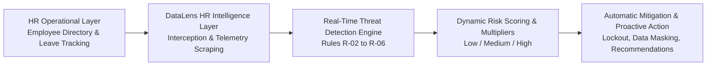
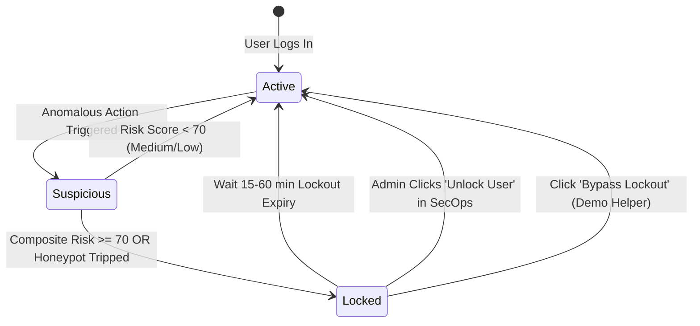
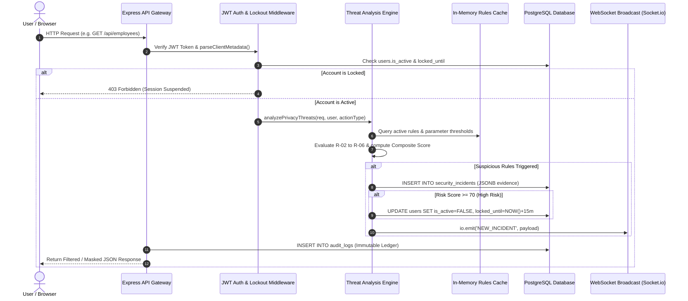
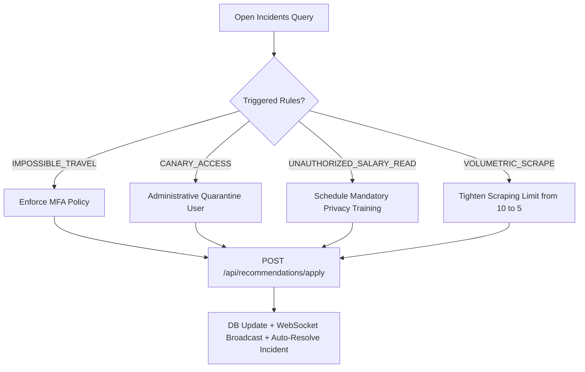

# DataLens HR – Comprehensive System Guide & Engineering Manual

A complete guide to the **DataLens HR Privacy Analytics and Decision Support System**, covering the system purpose, user accounts, operational workflows, and the underlying real-time privacy monitoring architecture.

---

## 📑 Table of Contents
1. [🌟 1. About the System](#-1-about-the-system)
   - [1.1 Executive Overview](#11-executive-overview)
   - [1.2 Problem Statement & Core Objectives](#12-problem-statement--core-objectives)
   - [1.3 Key Capabilities & Highlights](#13-key-capabilities--highlights)
   - [1.4 Technology Stack](#14-technology-stack)
   - [1.5 High-Level System Architecture](#15-high-level-system-architecture)
2. [👤 2. How to Use the Account (User & Operations Guide)](#-2-how-to-use-the-account-user--operations-guide)
   - [2.1 Role-Based Access Control (RBAC) Matrix](#21-role-based-access-control-rbac-matrix)
   - [2.2 Demo Credentials & Quick Switcher](#22-demo-credentials--quick-switcher)
   - [2.3 Authentication, MFA & Lockout Safeguards](#23-authentication-mfa--lockout-safeguards)
   - [2.4 Step-by-Step Account Workflows by Role](#24-step-by-step-account-workflows-by-role)
   - [2.5 Interactive Threat Simulator Guide](#25-interactive-threat-simulator-guide)
   - [2.6 Account Lockout & Recovery Procedure](#26-account-lockout--recovery-procedure)
3. [⚙️ 3. How the System Works (Under the Hood Architecture)](#️-3-how-the-system-works-under-the-hood-architecture)
   - [3.1 End-to-End Request Lifecycle](#31-end-to-end-request-lifecycle)
   - [3.2 Real-Time Threat Detection Engine (Rules R-02 to R-06)](#32-real-time-threat-detection-engine-rules-r-02-to-r-06)
   - [3.3 Composite Risk Scoring & Clearance Multiplier Formula](#33-composite-risk-scoring--clearance-multiplier-formula)
   - [3.4 Dynamic Mitigation & Recommendation Engine](#34-dynamic-mitigation--recommendation-engine)
   - [3.5 Immutable PostgreSQL Audit Ledger & Security Triggers](#35-immutable-postgresql-audit-ledger--security-triggers)
   - [3.6 Real-Time WebSocket Incident Streaming](#36-real-time-websocket-incident-streaming)
   - [3.7 Database Models & In-Memory Cache](#37-database-models--in-memory-cache)

---

## 🌟 1. About the System

### 1.1 Executive Overview
**DataLens HR** is an intelligent **Privacy Analytics and Decision Support System** engineered on top of a Human Resource Information System (HRIS). 

While standard HR systems focus solely on routine operational records (payroll, directory lookups, leave submissions), **DataLens HR adds an intelligent surveillance and threat mitigation layer**. It continuously observes user interactions, analyzes access patterns against baseline policies, quantifies privacy risks in real time, and automatically intervenes to prevent data breaches and privacy violations before sensitive employee information is exfiltrated.



### 1.2 Problem Statement & Core Objectives
Human Resource databases are among the highest-value targets for internal data leakage, credential abuse, and unauthorized probing because they store sensitive PII (Personally Identifiable Information), banking details, national IDs, and compensation packages.

**Key Objectives:**
1. **Zero-Trust Telemetry**: Intercept, audit, and log every API transaction, directory inspection, and salary read into a cryptographically protected, immutable audit log.
2. **Behavioral Threat Detection**: Detect anomalous behaviors including volumetric directory scraping, out-of-hours data querying, impossible geographic travel, and unauthorized salary probes.
3. **Decoy Canary Tripwires**: Deploy invisible honeypot profiles to instantly identify and quarantine insider threats and compromised accounts.
4. **Adaptive Risk Scoring**: Dynamically calculate composite risk scores factoring in user privilege multipliers (e.g. SysAdmin abuse incurs higher risk penalties).
5. **Proactive Policy Decision Support**: Formulate immediate automated remediations (temporary lockouts, field masking) and strategic security recommendations (MFA enforcement, threshold tightening).

### 1.3 Key Capabilities & Highlights

| Capability | Description |
| :--- | :--- |
| 🛡️ **Behavioral Rules Engine** | 5 configurable detection rules with dynamic weight configuration, active parameter caching, and runtime updates without server restarts. |
| 🪤 **Honeypot Canary Trap** | Decoy employee profiles (`Jane Honeypot`) seeded in the database. Any unauthorized access triggers an immediate High-severity security incident. |
| 🎭 **Dynamic Field Masking** | Protects sensitive salary fields dynamically. If a user accumulates suspicious behavior (Medium Risk), the system dynamically redacts directory data to `***.***`. |
| 🔒 **Immutable Audit Ledger** | PostgreSQL database triggers strictly prevent `UPDATE` or `DELETE` operations on audit logs, preventing attackers or malicious admins from erasing their tracks. |
| ⚡ **Live WebSocket Broadcasts** | Security incidents, risk telemetry, and mitigation events are pushed instantly to the SecOps dashboard via Socket.io without polling. |
| 💡 **1-Click Policy Enforcement** | Context-aware recommendation engine produces actionable remediations (e.g., Enforce MFA, Administrative Quarantine, Rate Tightening) executable with one click. |

### 1.4 Technology Stack

*   **Frontend**: React.js (SPA), TailwindCSS & Custom Design Tokens, Socket.io Client, Heroicons.
*   **Backend**: Node.js, Express.js REST API Gateway, Socket.io Engine, In-memory Sliding-Window Rate Counters.
*   **Database**: PostgreSQL 14+ with Connection Pooling (`pg`), Stored Trigger Functions, and JSONB Evidence Storage.
*   **Security & Auth**: JSON Web Tokens (JWT), BCrypt Password Hashing, HTTP Header Simulation Interceptors.

### 1.5 High-Level System Architecture

```text
┌──────────────────────────────────────────────────────────────────────────────────┐
│                            React.js Single Page UI                               │
│  [ SecOps Dashboard ]  [ Employee Directory ]  [ Leave Management ]  [ Rules ]   │
└─────────────────────────┬──────────────────────────────────┬─────────────────────┘
                          │ HTTP REST (JWT)                  │ WebSockets (Socket.io)
                          ▼                                  ▼
┌──────────────────────────────────────────────────────────────────────────────────┐
│                           Express.js API Gateway                                 │
│ ┌──────────────────────────────────────────────────────────────────────────────┐ │
│ │ Auth Middleware (JWT Token Verification, Account Lockout & Expiry Checks)    │ │
│ └──────────────────────────────────────┬───────────────────────────────────────┘ │
│                                        │                                         │
│                                        ▼                                         │
│ ┌──────────────────────────────────────────────────────────────────────────────┐ │
│ │ Privacy Intelligence & Threat Analysis Engine (server.js)                    │ │
│ │  • In-Memory Rule Cache (activeRulesCache)                                   │ │
│ │  • Sliding Window Volumetric Tracker (userRequestCounts)                     │ │
│ │  • Client Metadata Parser (IP, User-Agent, Simulated Geolocation)           │ │
│ └──────┬───────────────────────────────┬───────────────────────────────┬───────┘ │
│        │                               │                               │         │
│        ▼                               ▼                               ▼         │
│ ┌───────────────┐             ┌─────────────────┐             ┌────────────────┐ │
│ │  Rule Checks  │             │ Risk Multiplier │             │ Auto-Lockout   │ │
│ │  (R02 - R06)  │             │  (Score 0-100)  │             │  & Mitigation  │ │
│ └──────┬────────┘             └────────┬────────┘             └────────┬───────┘ │
└────────┼───────────────────────────────┼───────────────────────────────┼─────────┘
         │                               │                               │
         ▼                               ▼                               ▼
┌──────────────────────────────────────────────────────────────────────────────────┐
│                          PostgreSQL Database Layer                               │
│  ┌──────────────┐  ┌──────────────┐  ┌──────────────────┐  ┌──────────────────┐  │
│  │    users     │  │  employees   │  │  privacy_rules   │  │  leave_requests  │  │
│  ├──────────────┤  ├──────────────┤  ├──────────────────┤  ├──────────────────┤  │
│  │    roles     │  │ user_devices │  │security_incident │  │ audit_logs (IMM) │  │
│  └──────────────┘  └──────────────┘  └──────────────────┘  └──────────────────┘  │
└──────────────────────────────────────────────────────────────────────────────────┘
```

---

## 👤 2. How to Use the Account (User & Operations Guide)

### 2.1 Role-Based Access Control (RBAC) Matrix

DataLens HR enforces a strict 4-tier Role-Based Access Control model defined in [schema.sql](file:///e:/IEEE%20YP%202026/DataLens%20HR/backend/schema.sql):

| Feature / Module | System Administrator | HR Manager | HR Staff | Employee |
| :--- | :---: | :---: | :---: | :---: |
| **SecOps Live Threat Dashboard** | ✅ Full Access | ✅ View Only | ❌ No Access | ❌ No Access |
| **Real-Time Incident Resolution** | ✅ Full (Lock/Unlock/Dismiss) | ❌ No Access | ❌ No Access | ❌ No Access |
| **Privacy Rule Tuning (Weights/Params)** | ✅ Full Control | ❌ View Only | ❌ No Access | ❌ No Access |
| **Proactive Policy Enforcement** | ✅ 1-Click Apply | ❌ View Only | ❌ No Access | ❌ No Access |
| **Department Privacy Analytics** | ✅ Full Access | ✅ Full Access | ❌ No Access | ❌ No Access |
| **Employee Directory Listing** | ✅ Full Access | ✅ Full Access | ✅ Full Access | ✅ Self & Public |
| **View Unmasked Employee Salaries** | ✅ All Employees | ✅ All Employees | ❌ Masked (`***.***`) | ❌ Self Only |
| **Add / Delete Employees** | ✅ Full Control | ✅ Full Control | ❌ No Access | ❌ No Access |
| **Leave Approval / Rejection** | ✅ Full Control | ✅ Full Control | ❌ No Access | ❌ No Access |
| **Submit Leave Requests** | ✅ Self | ✅ Self | ✅ Self | ✅ Self |

### 2.2 Demo Credentials & Quick Switcher

For evaluation, demonstrations, and penetration testing, four pre-configured accounts are seeded in the database:

```text
┌────────────────────────┬───────────────────────────┬──────────────┬─────────────────────────┐
│ Role                   │ Email Address             │ Password     │ Primary Responsibilities│
├────────────────────────┼───────────────────────────┼──────────────┼─────────────────────────┤
│ System Administrator   │ admin@datalenshr.com      │ admin123     │ Security, Rules, Incidents│
│ HR Manager             │ manager@datalenshr.com    │ admin123     │ HR Ops, Salaries, Leaves│
│ HR Staff               │ staff@datalenshr.com      │ admin123     │ General Staff, Directory│
│ Employee               │ employee@datalenshr.com   │ admin123     │ Self Profile & Leaves   │
└────────────────────────┴───────────────────────────┴──────────────┴─────────────────────────┘
```

> [!TIP]
> **Account Switcher:** On the login screen, click any of the **Quick Demo Profile** buttons to automatically fill the credentials and switch roles instantly.

### 2.3 Authentication, MFA & Lockout Safeguards

1. **Login & JWT Token**: Upon successful authentication at `POST /api/auth/login`, an HMAC-SHA256 signed JSON Web Token is issued with a 24-hour expiration. The token is attached to all outbound requests in the `Authorization: Bearer <token>` header.
2. **Automated Account Suspension**: If an account incurs high-risk telemetry (composite score $\ge 70$), the system sets `users.is_active = FALSE` and assigns a `locked_until` timestamp (15–60 minutes lockout duration).
3. **Multi-Factor Authentication (MFA)**: When enabled via the Policy Recommendations engine (`mfa_enabled = TRUE`), enhanced session verification is enforced.

### 2.4 Step-by-Step Account Workflows by Role

#### 🛡️ A. System Administrator Workflow
*   **Live SecOps Monitoring**: Navigate to the **Security Dashboard** tab. Observe live incident cards, composite risk gauge, threat breakdown charts, and real-time alerts streamed over WebSockets.
*   **Incident Investigation & Mitigation**: Click on any incident card to inspect raw evidence (IP address, client user-agent, triggered rules, records accessed).
    *   Click **Lock User** to quarantine the user account for 15 minutes.
    *   Click **Unlock User** to reactivate an erroneously locked account.
    *   Click **Dismiss as False Positive** to mark the investigation resolved.
*   **Privacy Rules Configuration**: Navigate to the **Privacy Rules** tab. Adjust rule weights, toggle rules on/off, and tune runtime parameters (e.g., change `R-02` off-hours window or `R-05` volumetric limit from 10 to 5 requests).
*   **Applying Proactive Recommendations**: Go to the **Recommendations** tab. Review suggestions generated by the system (e.g. Enforce MFA, Quarantine Account, Tighten Scraping Limits) and click **Apply Policy Recommendation** to execute changes across the database instantly.

#### 👥 B. HR Manager Workflow
*   **Employee Directory Management**: Open the **Employees** tab. View complete employee profiles including unmasked annual salaries. Click **+ Add Employee** to register a new hire or click the trash icon to delete an employee.
*   **Leave Management**: Open the **Leave Requests** tab. Review pending time-off submissions from all departments. Click **Approve** or **Reject** with status updates audited in the database.
*   **Department Analytics**: Open the **Analytics** tab to inspect department-level privacy trends, average risk scores, and total records accessed across Finance, HR, Engineering, and Sales.

#### 📝 C. HR Staff Workflow
*   **Employee Directory Browsing**: Search and filter employee directories. Notice that salary values are automatically masked as `***.***` due to field-level RBAC restrictions.
*   **Self-Service Leaves**: Submit personal leave applications and view request approval history.

#### 💼 D. Employee Workflow
*   **Profile Inspection**: View personal profile information and salary details (employees can only view their own salary).
*   **Leave Submissions**: Submit time-off requests specifying leave type (Casual, Medical, Annual), start/end dates, and justification reason.

---

### 2.5 Interactive Threat Simulator Guide

DataLens HR includes a built-in **Threat Simulation Suite** located on the top bar of the application. Use this bar to trigger realistic attack scenarios and observe how the detection engine responds:

```text
┌────────────────────────────────────────────────────────────────────────────────────────┐
│ 🧪 Quick Threat Simulator: [ 🌍 Impossible Travel ] [ ⚡ Rapid Scraping ] [ 💰 Salary Probe ] [ 🪤 Canary Access ] │
└────────────────────────────────────────────────────────────────────────────────────────┘
```

1. **Simulate Impossible Travel (Rule R-03)**:
   *   *Action*: Click **🌍 Impossible Travel**.
   *   *What Happens*: The client sends an `x-simulate-impossible-travel: true` header simulating a login from Colombo and Tokyo within 5 minutes.
   *   *Result*: A 50-point risk incident is flagged; the recommendation engine proposes enforcing MFA.
2. **Simulate Rapid Volumetric Scraping (Rule R-05)**:
   *   *Action*: Click **⚡ Rapid Scraping** or rapidly refresh employee profiles.
   *   *What Happens*: The sliding-window counter exceeds 10 profile reads within 10 seconds.
   *   *Result*: A 45-point incident is triggered; the system recommends tightening the scrape limit to 5.
3. **Simulate Unauthorized Salary Probing (Rule R-04)**:
   *   *Action*: Log in as **HR Staff** or **Employee** and attempt to query another user's `/api/employees/:id/salary` endpoint.
   *   *What Happens*: The backend catches the unauthorized field read attempt and logs an `UNAUTHORIZED_SALARY_READ` action.
   *   *Result*: A 40-point incident is registered; the recommendation engine suggests mandatory privacy training.
4. **Simulate Decoy Canary Access (Rule R-06)**:
   *   *Action*: In the Employee Directory, click or inspect the record for **Jane Honeypot** (`Senior Executive VP`).
   *   *What Happens*: The canary tripwire is triggered.
   *   *Result*: An immediate **80-point Critical incident** is generated, automatically quarantining and locking the offending user session for 15 minutes.
5. **Simulate Unusual Working Hours (Rule R-02)**:
   *   *Action*: Access sensitive endpoints between 11:00 PM and 05:00 AM (or adjust system time / rule parameters).
   *   *Result*: Flags an off-hours access alert with a 15-point risk score penalty.

---

### 2.6 Account Lockout & Recovery Procedure



> [!NOTE]
> **Testing Convenience**: If an account is locked during demonstration, a red lockout banner appears with a **Bypass Lockout (Demo)** button calling `POST /api/auth/bypass-lockout` to restore access immediately.

---

## ⚙️ 3. How the System Works (Under the Hood Architecture)

### 3.1 End-to-End Request Lifecycle

Every incoming HTTP request traverses a multi-stage security pipeline in [server.js](file:///e:/IEEE%20YP%202026/DataLens%20HR/backend/server.js):



### 3.2 Real-Time Threat Detection Engine (Rules R-02 to R-06)

The detection engine maintains in-memory rule caches loaded from `privacy_rules` table:

```text
┌──────┬─────────────────────┬────────┬─────────────────────────┬────────────────────────────────────────────────────────┐
│ ID   │ Rule Identifier     │ Weight │ Default Parameters      │ Detection Mechanism                                    │
├──────┼─────────────────────┼────────┼─────────────────────────┼────────────────────────────────────────────────────────┤
│ R-02 │ UNUSUAL_HOURS       │ 15     │ {start_hour: 23, end: 5}│ Evaluates server timestamp against off-hours window.   │
│ R-03 │ IMPOSSIBLE_TRAVEL   │ 50     │ {}                      │ Analyzes geographic Delta & speed anomaly headers.      │
│ R-04 │ SPI_SALARY_PROBE    │ 40     │ {}                      │ Detects non-privileged attempts to access salary data. │
│ R-05 │ VOLUMETRIC_SCRAPE   │ 45     │ {limit: 10, window: 10s}│ Sliding window in-memory array tracking request rate.  │
│ R-06 │ CANARY_ACCESS       │ 80     │ {}                      │ Detects reads on decoy record (is_canary = TRUE).      │
└──────┴─────────────────────┴────────┴─────────────────────────┴────────────────────────────────────────────────────────┘
```

#### Detailed Rule Logic:
*   **R-02 (Unusual Working Hours)**: Reads `currentHour = new Date().getHours()`. If `currentHour >= start_hour || currentHour < end_hour`, an access violation is flagged.
*   **R-03 (Impossible Travel)**: Parses client geolocation metadata. Detects sudden coordinate switches indicating credential sharing or VPN exit proxy hopping.
*   **R-04 (Salary Probing)**: Evaluates endpoint authorization. If an unprivileged user hits `/api/employees/:id/salary`, the request is blocked and logged as an active probe.
*   **R-05 (Volumetric Scraping)**: Maintains an in-memory hash `userRequestCounts[userId] = [t1, t2, ...]`. Timestamps older than `window_ms` are discarded. If remaining count exceeds `limit`, a bulk harvesting alert triggers.
*   **R-06 (Canary Trap / Honeypot)**: The `employees` table includes decoy entries flagged with `is_canary = TRUE`. Legitimate users have no reason to access this fake profile. Any access immediately trips this trap.

---

### 3.3 Composite Risk Scoring & Clearance Multiplier Formula

When one or more rules trigger during a single transaction, the system computes a dynamic composite score:

$$\text{Composite Risk Score} = \min\left(100, \;\; \left( \sum_{i \in \text{Triggered}} \text{Weight}_i \right) \times \text{Role Multiplier}\right)$$

#### Role Clearance Multipliers:
Privileged accounts carry higher insider blast radius. If an administrator account exhibits anomalous activity, the potential damage is significantly greater:
*   **System Administrator Multiplier**: **$1.4\times$**
*   **HR Manager Multiplier**: **$1.25\times$**
*   **HR Staff / Regular Employee Multiplier**: **$1.0\times$**

#### Severity Classifications:
*   🔴 **High Risk ($\text{Score} \ge 70$)**: Triggers immediate automated account lockout (15–60 minutes), session revocation, and urgent SecOps notification.
*   🟡 **Medium Risk ($40 \le \text{Score} < 70$)**: Triggers dynamic field-level data masking (all salaries masked), warning notices, and password reset recommendations.
*   🟢 **Low Risk ($\text{Score} < 40$)**: Logged in the audit trail for periodic compliance reviews.

---

### 3.4 Dynamic Mitigation & Recommendation Engine

The proactive recommendation engine (`GET /api/analytics/recommendations`) inspects open incidents and generates contextual security mitigations:



When an administrator clicks **Apply Policy Recommendation**:
1. `ENFORCE_MFA`: Updates `users.mfa_enabled = TRUE`, logs audit entry, and resolves the linked incident.
2. `QUARANTINE_USER`: Updates `users.is_active = FALSE` with a 60-minute lockout timestamp.
3. `SCHEDULE_TRAINING`: Updates incident notes and creates an administrative compliance record.
4. `TIGHTEN_SCRAPE_LIMIT`: Dynamically updates `privacy_rules.parameters` for `R-05` and refreshes the in-memory cache.

---

### 3.5 Immutable PostgreSQL Audit Ledger & Security Triggers

To prevent insider tampering or log deletion by compromised administrator accounts, the `audit_logs` table is enforced as an **append-only, immutable ledger** via PostgreSQL triggers in [schema.sql](file:///e:/IEEE%20YP%202026/DataLens%20HR/backend/schema.sql):

```sql
-- Trigger function prohibiting UPDATE or DELETE on audit_logs
CREATE OR REPLACE FUNCTION prevent_audit_modification()
RETURNS TRIGGER AS $$
BEGIN
    RAISE EXCEPTION 'Audit log table is immutable. Modifications are strictly prohibited.';
END;
$$ LANGUAGE plpgsql;

CREATE TRIGGER prevent_audit_update
BEFORE UPDATE ON audit_logs
FOR EACH ROW EXECUTE FUNCTION prevent_audit_modification();

CREATE TRIGGER prevent_audit_delete
BEFORE DELETE ON audit_logs
FOR EACH ROW EXECUTE FUNCTION prevent_audit_modification();
```

> [!IMPORTANT]
> Any direct SQL attempt by a database user to `UPDATE` or `DELETE` records from `audit_logs` will throw a fatal PostgreSQL exception, preserving the legal integrity of the audit trail.

---

### 3.6 Real-Time WebSocket Incident Streaming

DataLens HR uses bidirectional WebSocket channels powered by Socket.io:

```text
Backend Event: io.emit('NEW_INCIDENT', { incidentId, user_email, risk_score, risk_level, ... })
        │
        ▼
Frontend Listener: socket.on('NEW_INCIDENT', (data) => { ... })
        │
        ├─► Prepends incident to Live Incident Feed
        ├─► Triggers audio-visual SecOps alert badge
        └─► Updates Department Risk Metrics & Score Gauges dynamically
```

Similarly, when an administrator mitigates or resolves an incident, an `INCIDENT_RESOLVED` event is broadcast to keep all open browser sessions synchronized.

---

### 3.7 Database Models & In-Memory Cache

The relational architecture comprises 6 interconnected tables:

```text
┌─────────────────┐       ┌─────────────────┐       ┌──────────────────────┐
│      roles      │       │      users      │       │     user_devices     │
├─────────────────┤       ├─────────────────┤       ├──────────────────────┤
│ id (PK)         │◄──────┤ role_id (FK)    │◄──────┤ user_id (FK)         │
│ name            │       │ id (PK)         │       │ device_hash          │
│ description     │       │ email           │       │ browser_family       │
└─────────────────┘       │ password_hash   │       │ os_family            │
                          │ is_active       │       │ last_used            │
                          │ mfa_enabled     │       └──────────────────────┘
                          │ locked_until    │
                          └────────┬────────┘
                                   │
         ┌─────────────────────────┼─────────────────────────┐
         │                         │                         │
         ▼                         ▼                         ▼
┌─────────────────┐       ┌─────────────────┐       ┌──────────────────────┐
│    employees    │       │   audit_logs    │       │  security_incidents  │
├─────────────────┤       ├─────────────────┤       ├──────────────────────┤
│ id (PK)         │       │ id (BIGSERIAL)  │       │ id (PK)              │
│ user_id (FK)    │       │ user_id (FK)    │       │ user_id (FK)         │
│ first_name      │       │ user_role       │       │ triggered_rules (JSON)│
│ last_name       │       │ timestamp       │       │ raw_evidence (JSONB) │
│ department      │       │ ip_address      │       │ risk_score           │
│ position        │       │ device_browser  │       │ risk_level           │
│ salary          │       │ location_city   │       │ recommended_actions  │
│ is_canary       │       │ request_path    │       │ mitigation_executed  │
└────────┬────────┘       │ action_type     │       │ status               │
         │                └─────────────────┘       └──────────────────────┘
         ▼
┌─────────────────┐       ┌─────────────────┐
│ leave_requests  │       │  privacy_rules  │
├─────────────────┤       ├─────────────────┤
│ id (PK)         │       │ id (PK)         │
│ employee_id(FK) │       │ name            │
│ leave_type      │       │ weight          │
│ start_date      │       │ is_enabled      │
│ end_date        │       │ parameters(JSON)│
│ status          │       └─────────────────┘
└─────────────────┘
```

---

## 🚀 Quick Verification & Testing Commands

To verify that the entire suite is functioning correctly, you can run the backend and frontend services:

```bash
# 1. Initialize PostgreSQL Schema & Mock Data
cd backend
node setup_db.js

# 2. Start Backend API & Socket Server (Port 5000)
npm run dev

# 3. Start Frontend Vite Client (Port 5173)
cd ../frontend
npm run dev
```

Visit **[http://localhost:5173](http://localhost:5173)** in your browser, log in with any seed profile, and test the threat simulators to experience the privacy analytics suite in action.
